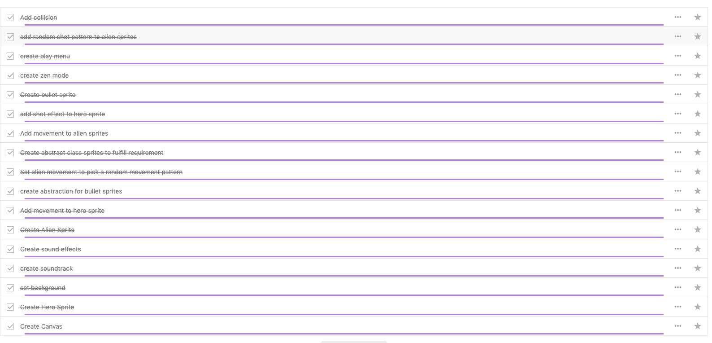

<h1>The Problem Solving Framework : 'UPER'</h1>

* U = "Understand"
* P = "Plan"
* E = "Execute"
* R = "Reflect" / "Refactor"

<h2>1. Understanding the Problem</h2>
I have been asked to create a game using an interface, abstract class, stream and lambda. 
<h2>
    2. Planning the Solution
</h2>
I used a nextcloud task list to set up all the tasks that should be implemented. 
I attempted the UML tool but it seems counterintuitive to start designing a game when we dont even know how to render anything onto the screen yet. 

  
 

 I started by adding all of the features I wanted to have in my game. Then as I completed each feature and tested it,
 I marked it off the list. 
 I chose libgdx because of its ability to transpile to html, but the Lambda syntax is not supported in libgdx HTML transpiling. 
 
 
 
 

<h2>
    3. Executing the Plan
</h2>
I watched a ton of videos and read a ton of guides on how to implement a game in libgdx. 
I then talked with Mark and Craig when I got to the collision aspect of the game. 
Most of my time was spent researching, maybe 10% was spent writing code. 
<h2>
    4. Reflection / Refactor
</h2>
The Lambda stream syntax is not supported in the libgdx transpiling to html so I had to scrap it from the project and edit the gradle.build files. 
I originally started by using Box2d(game physics engine) but realized very quickly that the app would be huge and have a ton of unneeded complexity and logic. 
This made the collision detection very hard to implement as collision in box2d is handled automagically whereas doing your own means everything needs to be a rectangle.
When things are a rectangle, you have both the sprite texture x and y to deal with as well as the rectangle collision bounding box to deal with. 
I did not realize that I needed to update both for a very long time. (All of the guides used box2d.)
In my talk with Craig, I learned that just because a guide says to do something a certain way, doesnt mean it is right, which led to a bit of refactoring of the collision implementation.
I cleanly handled exit error 255 on application close by providing an escape listener call in the GameMain class. 